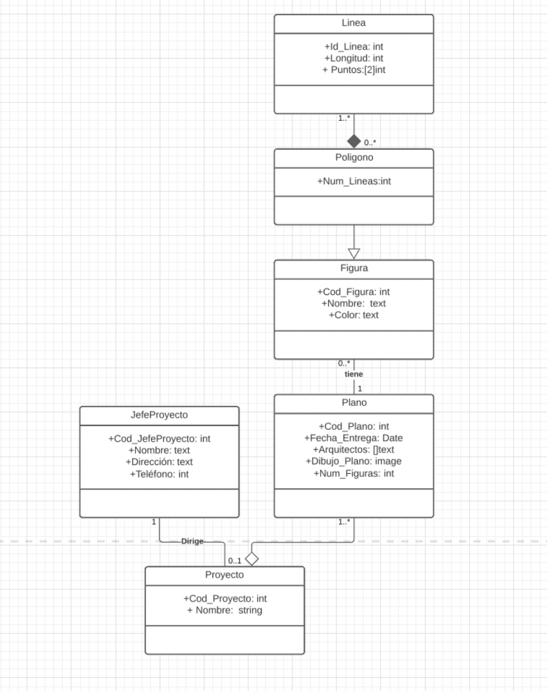

# Práctica 6: Arquitectos
Práctica 6 de la asignatura AyDBBDD

Sergio Pitti de Armas - alu0101232812
Diego Rodríguez Pérez - alu0101203980
Teresa Bonet Costa - alu0101523644

# Modelo Objeto-Relacional VS Relacional

La base de datos objeto-relacional es una extensión de la base de datos relacional tradicional, a la cual se le proporcionan características de la programación orientada a objetos.

Nacen como una extensión del modelo relacional, en el que los dominios de dicha base de datos ya no son sólo atómicos, por lo que no se cumple la 1FN, debido a que las tuplas también pueden ser una relación, que llevará a la creación de una relación de relaciones. De este modo, se genera la posibilidad de guardar objetos más complejos en una sola tabla con referencias a otras relaciones, con lo que se acerca más al paradigma de POO.

# UML Proyecto de Arquitectura

