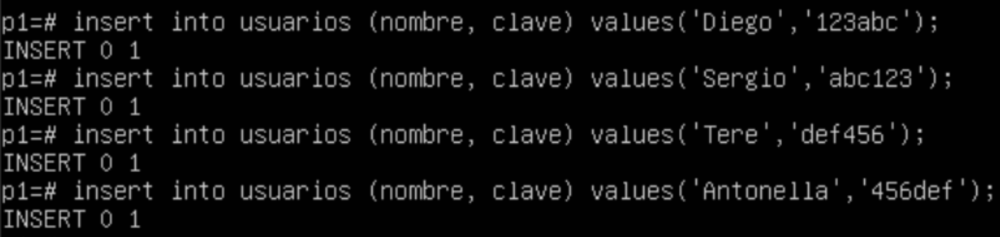

## Introducción a PostgresQL

Lo primero que debemos hacer es instalar PostgresQL. Para ello utilizaremos el comando

`sudo apt-get install postgresql`


Para crear un usuario, deberemos autenticarnos como super usuario y postrioremente crear este usuario:

```
sudo su postgres
create user [usuario]
```


## Test Práctico

* Creamos la base de datos P1:  
`CREATE DATABASE P1;`


* Comprobamos si se ha creado listando todas las bases:  
`\l`


* Nos conectamos a la base de datos P1:  
`\c P1 postgres`


* Creamos la tabla:  
`create table usuarios (nombre varchar(35), clave varchar(15));`


* Insertamos los datos:  
`into usuarios ( nombre, clave ) values ( ‘ ’ , ’ ’ )` 



* Comprobamos si se han insertado mediante una consulta:  
`SELECT * FROM usuarios` 


